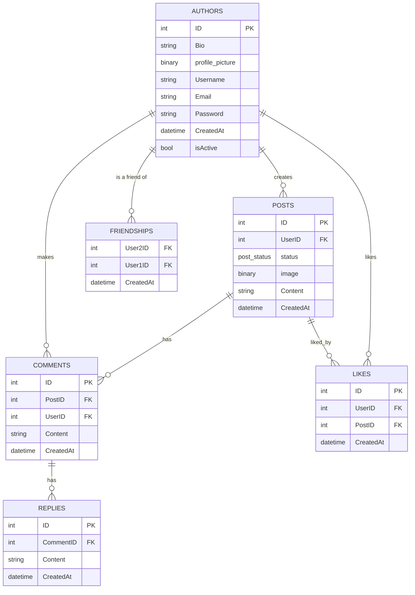

<!--     <!-- GROUPS {
      int ID PK
      string GroupName
      string Description
      datetime CreatedAt
    }

    GROUP_MEMBERS {
      int GroupID FK
      int UserID FK
      datetime JoinedAt
    } --> -->