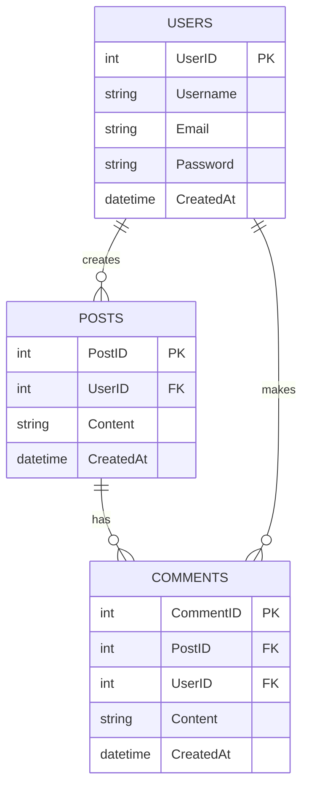

# Entity Relationship Diagram

```mermaid
erDiagram
    %% Define Entities and Their Attributes
    USERS {
      int UserID PK
      string Username
      string Email
      string Password
      datetime CreatedAt
    }
    
    POSTS {
      int PostID PK
      int UserID FK
      string Content
      datetime CreatedAt
    }
    
    COMMENTS {
      int CommentID PK
      int PostID FK
      int UserID FK
      string Content
      datetime CreatedAt
    }
    
    %% Define Relationships
    USERS ||--o{ POSTS: "creates"
    POSTS ||--o{ COMMENTS: "has"
    USERS ||--o{ COMMENTS: "makes"

```