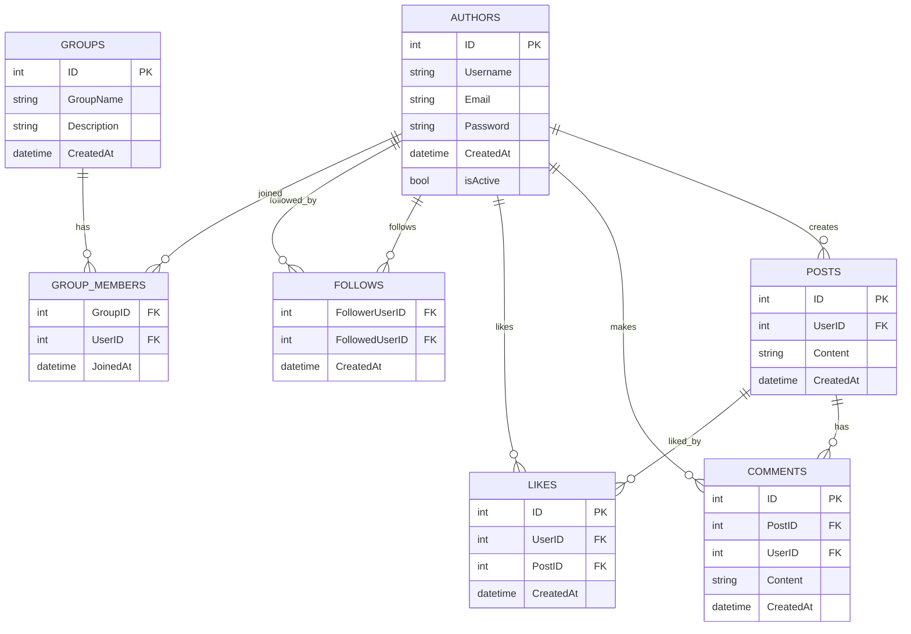

```mermaid
erDiagram
    %% Define Entities and Their Attributes
    AUTHORS {
      int ID PK
      string Username
      string Email
      string Password
      datetime CreatedAt
      bool isActive
    }
    
    POSTS {
      int ID PK
      int UserID FK
      string Content
      datetime CreatedAt
    }
    
    COMMENTS {
      int ID PK
      int PostID FK
      int UserID FK
      string Content
      datetime CreatedAt
    }
    
    LIKES {
      int ID PK
      int UserID FK
      int PostID FK
      datetime CreatedAt
    }
    
    GROUPS {
      int ID PK
      string GroupName
      string Description
      datetime CreatedAt
    }

    GROUP_MEMBERS {
      int GroupID FK
      int UserID FK
      datetime JoinedAt
    }

    FOLLOWS {
      int FollowerUserID FK
      int FollowedUserID FK
      datetime CreatedAt
    }
    
    %% Define Relationships
    AUTHORS ||--o{ POSTS: "creates"
    POSTS ||--o{ COMMENTS: "has"
    AUTHORS ||--o{ COMMENTS: "makes"
    AUTHORS ||--o{ LIKES: "likes"
    POSTS ||--o{ LIKES: "liked_by"
    AUTHORS ||--o{ FOLLOWS: "follows"
    AUTHORS ||--o{ FOLLOWS : "followed_by"
    GROUPS ||--o{ GROUP_MEMBERS: "has"
    AUTHORS ||--o{ GROUP_MEMBERS: "joined"
```