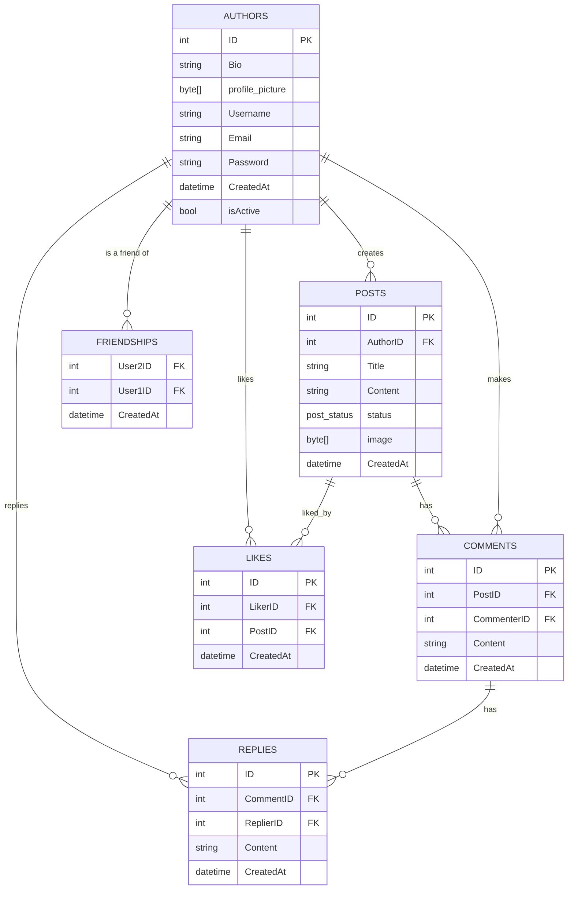

```mermaid
erDiagram
    %% Define Entities and Their Attributes
    AUTHORS {
      int ID PK
      string Bio
      byte[] profile_picture
      string Username
      string Email
      string Password
      datetime CreatedAt
      bool isActive
    }
    
    POSTS {
      int ID PK
      int AuthorID FK
      string Title
      string Content
      post_status status
      byte[] image
      datetime CreatedAt
    }
    
    COMMENTS {
      int ID PK
      int PostID FK
      int CommenterID FK
      string Content
      datetime CreatedAt
    }

    REPLIES {
      int ID PK
      int CommentID FK
      int ReplierID FK
      string Content
      datetime CreatedAt
    }

    FRIENDSHIPS {
      int User2ID FK
      int User1ID FK
      datetime CreatedAt
    }
    
    LIKES {
      int ID PK
      int LikerID FK
      int PostID FK
      datetime CreatedAt
    }
    
    
    %% Define Relationships
    AUTHORS ||--o{ POSTS: "creates"
    POSTS ||--o{ COMMENTS: "has"
    AUTHORS ||--o{ COMMENTS: "makes"
    AUTHORS ||--o{ LIKES: "likes"
    AUTHORS ||--o{ REPLIES: "replies"
    POSTS ||--o{ LIKES: "liked_by"
    AUTHORS ||--o{ FRIENDSHIPS: "is a friend of"
    COMMENTS ||--o{ REPLIES: "has"
```