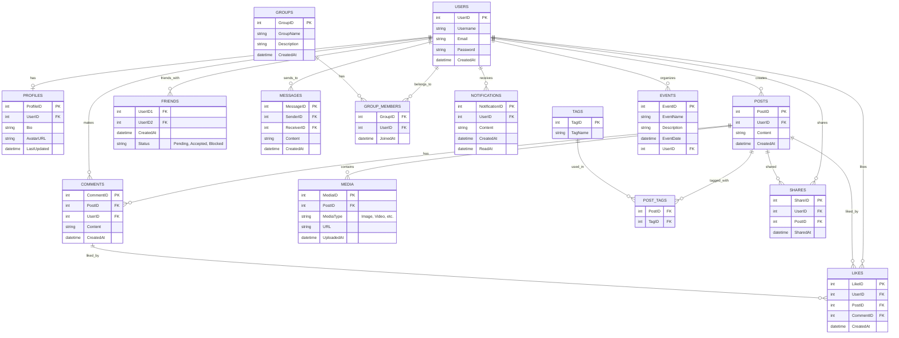

```mermaid
erDiagram
    %% Define Core Entities and Their Attributes
    USERS {
      int UserID PK
      string Username
      string Email
      string Password
      datetime CreatedAt
    }

    PROFILES {
      int ProfileID PK
      int UserID FK
      string Bio
      string AvatarURL
      datetime LastUpdated
    }
    
    POSTS {
      int PostID PK
      int UserID FK
      string Content
      datetime CreatedAt
    }

    COMMENTS {
      int CommentID PK
      int PostID FK
      int UserID FK
      string Content
      datetime CreatedAt
    }

    LIKES {
      int LikeID PK
      int UserID FK
      int PostID FK
      int CommentID FK
      datetime CreatedAt
    }

    FRIENDS {
      int UserID1 FK
      int UserID2 FK
      datetime CreatedAt
      string Status "Pending, Accepted, Blocked"
    }

    MESSAGES {
      int MessageID PK
      int SenderID FK
      int ReceiverID FK
      string Content
      datetime CreatedAt
    }

    GROUPS {
      int GroupID PK
      string GroupName
      string Description
      datetime CreatedAt
    }

    GROUP_MEMBERS {
      int GroupID FK
      int UserID FK
      datetime JoinedAt
    }

    MEDIA {
      int MediaID PK
      int PostID FK
      string MediaType "Image, Video, etc."
      string URL
      datetime UploadedAt
    }

    NOTIFICATIONS {
      int NotificationID PK
      int UserID FK
      string Content
      datetime CreatedAt
      datetime ReadAt
    }

    TAGS {
      int TagID PK
      string TagName
    }

    POST_TAGS {
      int PostID FK
      int TagID FK
    }

    EVENTS {
      int EventID PK
      string EventName
      string Description
      datetime EventDate
      int UserID FK
    }

    SHARES {
      int ShareID PK
      int UserID FK
      int PostID FK
      datetime SharedAt
    }

    %% Define Relationships
    USERS ||--o{ POSTS: "creates"
    POSTS ||--o{ COMMENTS: "has"
    USERS ||--o{ COMMENTS: "makes"
    USERS ||--o{ LIKES: "likes"
    POSTS ||--o{ LIKES: "liked_by"
    COMMENTS ||--o{ LIKES: "liked_by"
    USERS ||--o{ FRIENDS : "friends_with"
    USERS ||--o{ MESSAGES : "sends_to"
    USERS ||--o{ GROUP_MEMBERS : "belongs_to"
    GROUPS ||--o{ GROUP_MEMBERS : "has"
    POSTS ||--o{ MEDIA : "contains"
    USERS ||--o{ NOTIFICATIONS : "receives"
    POSTS ||--o{ POST_TAGS : "tagged_with"
    TAGS ||--o{ POST_TAGS : "used_in"
    USERS ||--o{ EVENTS : "organizes"
    USERS ||--o{ SHARES : "shares"
    POSTS ||--o{ SHARES : "shared"
    USERS ||--o| PROFILES : "has"

```